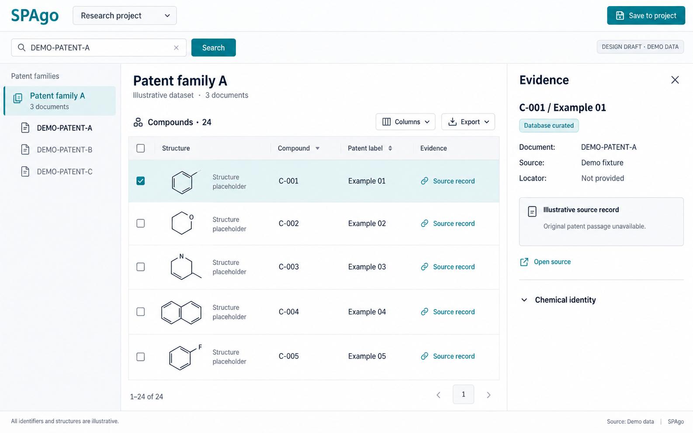
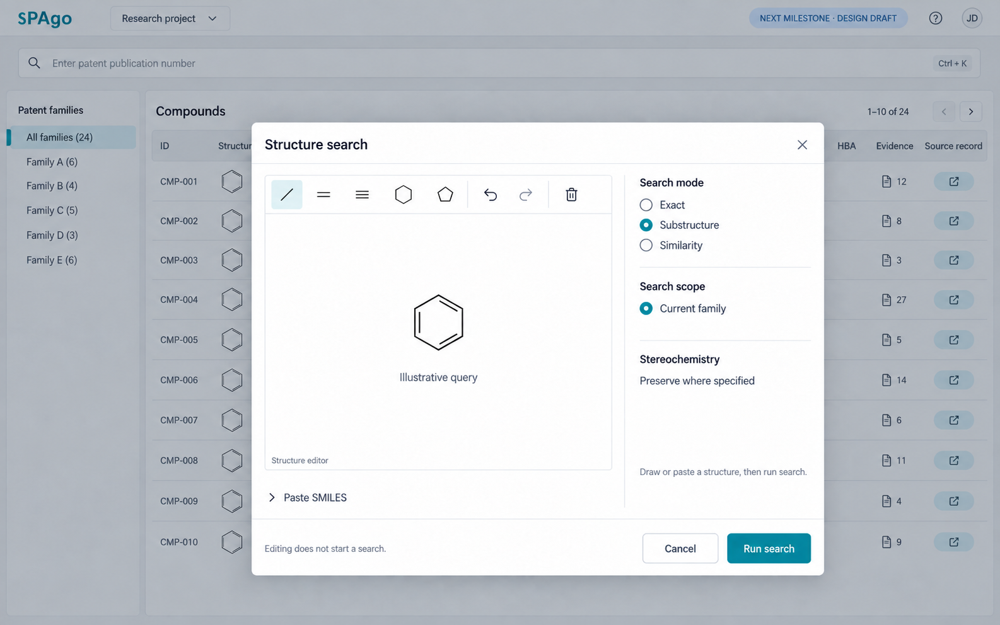

# SPAgo 前端 UI 设计指引

日期：2026-09-14。状态：待用户评审的设计提案；尚未实施。

## 依据与 Q&A

已阅读根目录 README.md、PROMPT.md、AGENTS.md 及已完成的重命名计划。当前仓库只有文档，没有前端、接口、可运行页面或真实数据夹具。本次产物是视觉草稿和执行指引，不证明功能已实现。

| 问题 | 当前设计决定 / 待确认项 |
| --- | --- |
| 首期服务哪个任务？ | 输入专利公开号，查看同族和结构列表，核对来源，保存所选对象。 |
| 是否直接实现完整愿景？ | 按 README 的 M0/M1 起步；PROMPT 的完整 MVP 路径作为后续里程碑组合。 |
| 默认同时显示 Evidence 和 AI？ | 否。证据按需展开；M5 的 AI 将复用右侧检查区，通过标签切换，引用可切回证据。 |
| 首期是否有全文/PDF 定位？ | 取决于实际数据覆盖。只有数据库关联时展示来源记录；缺页码或原文时明确说明，不伪造定位。 |
| 界面语言？ | 草稿采用英文，便于科研术语排版；说明采用中文。语言偏好尚待用户评审。 |
| 表格密度与面板位置？ | 默认舒适密度，证据在右侧；真实长结构与长证据需要实施时验证。 |

## 草稿

### 01：首期专利化学工作台

顶部保留项目上下文和唯一保存入口；其下为专利号搜索。左侧是当前同族与成员文档；中央是化合物表；点击证据在右侧展开检查区。关闭证据后空间归还表格。

图内编号、计数、结构和出处均为演示占位，不能做科学测试夹具。结构图必须由后端 RDKit 生成。图中复选框勾选与行高亮同时出现只是示例；实现中分别管理批量选择和当前查看对象。图中 24 条是演示总数，可视窗口只画部分行；不得把它作为分页实现规格。

### 02：后续结构检索

进入 M2 后，搜索行增加唯一的 Structure 入口，打开编辑对话框。保留 Exact / Substructure / Similarity 三种模式，初期检索范围固定为当前同族。相似度模式才显示阈值和指纹/度量说明；具体默认值待化学服务契约确定。绘图和粘贴仅改变草稿，点击 Run search 才请求服务。图内工具栏是位置示意，实施时嵌入 Ketcher 实际控件，不自建化学编辑器。

## 范围

| 分类 | 能力 |
| --- | --- |
| CORE：M0/M1 | 专利号查询、同族与文档、虚拟化结构表、来源检查、项目保存、CSV/SDF 导出、缺失与失败状态。保存属于 M1，M0 不显示可操作的假保存按钮。 |
| NEXT：M2 | 当前同族内结构检索对话框、显式执行、查询取消、结构过滤条件摘要。 |
| LATER：M3–M6 | 活性/SAR 列、跨同族分析、扩展、证据 AI、经评估后的 PDF/OCSR。 |
| REJECT | 无证据活性结论、FTO 定论、自动 Espacenet 操作、默认铺开工具面板。 |

## 布局与视觉规格

- 桌面基准 1440×900；顶部 56px、搜索行约 64px；同族侧栏 232px，证据区 360–420px，表格占剩余宽度。
- 1280px 以下同族导航可收起；1024px 以下证据改为覆盖抽屉；小屏同族为选择器，证据全屏。表格在自身容器横向滚动，整页不横向溢出。
- 白色面板，画布 #F6F8FA，正文 #172B3A，次级文字 #52616B，分隔线 #DCE3E8，主色 #087F8C，选中底色 #E7F4F5。实际颜色对比须在实现时验证。
- 正文 14px，辅助文字 12px，区域标题 18–22px。专利号/SMILES 可用等宽字体。采用系统无衬线字体，不新增字体服务。
- 4/8px 间距尺度，边框 1px、圆角 6px；表头 40px、结构行初始约 96px，结构缩略图约 144×80px。复杂分子允许打开更大预览，不裁断结构。
- 来源状态同时用文字和图标表达，不能仅靠颜色。每个按钮有焦点样式与可访问名称。

## 关键交互契约

1. **查询**：输入公开号 → Enter 或 Search 执行。空值/格式错误就地提示；加载时提供取消。新查询作废旧请求，迟到响应不得覆盖新结果。普通元数据过滤再采用 debounce。
2. **同族**：同族总览展示跨文档去重结构；选择成员文档后明确显示该文档范围。不能因化合物标签相同而合并身份。
3. **表格**：默认列为复选框、结构、内部化合物标识、专利局部标签、证据入口。真实记录缺 Example 时显示未提供；多个出现位置可展开列表，并带文档号。点击行查看对象，复选框仅用于批选，不混用状态。
4. **证据**：一键进入所选出现位置；同一化合物多个来源可切换。呈现文档、章节/页/段/表等已有定位、原始摘录、来源链接、提取方法、来源状态、检索时间及数据版本。缺字段明确标为未提供；数据库关联不等于专利原文证据。
5. **化学身份**：折叠区展示 canonical SMILES、InChIKey、立体信息和归一化记录；支持复制。图里的示意环不参与任何识别或检索。
6. **保存**：有勾选时保存所选化合物，无勾选时对话框明确保存当前同族；确认范围、目标项目与来源版本后提交。失败保留选择并可重试；成功显示已保存，重复提交不重复创建。
7. **导出**：统一 Export 菜单选择 CSV/SDF，明确“所选”或“当前筛选结果”。保留原始专利标识、结构标识与证据引用；不能静默仅导出当前加载页。较大导出用有持久状态的后台任务。
8. **M2 结构查询**：空结构与解析失败禁止执行并说明原因。取消对话框不应用草稿；运行后显示模式和范围摘要，可一次移除。保留指定立体化学，不默认提供忽略立体信息选项。
9. **URL**：保存查询公开号、family/document/compound/project 标识及普通筛选；返回与刷新可恢复上下文。大结构用受控查询标识恢复，不塞进长 URL；项目访问仍需权限校验。
10. **键盘**：表格焦点、行查看、复选框可独立操作。抽屉/对话框支持 Escape、焦点约束与关闭后焦点归还；异步完成和错误通过可访问状态通知。

## 必须设计和验证的状态

| 状态 | 界面行为 |
| --- | --- |
| 初次打开 | 单一专利号输入和短说明；不预置伪装为真实的科学数据。 |
| 加载 | 保持框架，行/结构占位；显示正在加载及取消，禁止重复请求。 |
| 未找到专利 | 保留输入，允许修改重试。 |
| 专利存在但无结构 | 保留元数据，明确当前来源未提供结构；不自动启动 OCSR。 |
| 来源不可用或限流 | 保留可用数据，标明失败来源及可重试状态；缓存结果显示获取时间。 |
| 某个描图失败 | 该行显示结构不可显示，其他行可用；原始标识仍可访问。 |
| 缺少证据位置 | 展示可用来源记录，说明原文定位未提供；无 URL 时不显示可点击 Open source。 |
| 无活性数据（M3） | 显示未提供，不能解释为无活性；测定条件不一致时不能直接排名或计算选择性。 |
| 保存/导出失败 | 保留用户选择、范围和项目，给出重试；不显示成功状态。 |

## 后续实施顺序与验收

这是待评审顺序，不替换当前根 PROMPT.md。用户评审意见先记回本文件 Q&A，再形成 scoped plan，最后更新稳定执行 PROMPT。

1. M0：前后端外壳、规范化契约、真实小夹具及 benchmark。页面证明一个专利和化合物列表可加载；来源缺失可见。
2. M1：接通同族、行选择、证据和项目保存；CSV/SDF 导出保留来源关系。再覆盖键盘与不同宽度。
3. M2：加入结构对话框和明确查询状态；采用化学回归夹具验证 exact/substructure/similarity 与立体信息。
4. M3/M5：有可信测量后才加入活性列；有证据服务与引用回跳后才加入 AI。AI 是检查区标签，不再增加永久第四列。

实施时沿用项目提出的 React/TypeScript/Vite 方向；表格状态、可见行、服务端查询分别承担明确职责。此次没有选定新依赖或修改架构。

验收必须证明：公开号→同族→化合物→证据→保存后重载可恢复；两个文档相同局部标签不会混淆；旧查询响应不会覆盖新查询；不可用来源不拖垮其他内容。使用真实 RDKit 夹具，不以草稿图化学结构代替测试。

性能：默认请求 100 行、普通上限 500；服务端排序筛选、虚拟行与可见/邻近描图。记录启动、查询、分页、描图、载荷、内存、滚动与外部调用基线，后续结构搜索记录其耗时。此次没有运行应用或测量性能，响应阈值待 M0 基线确定。

## 生成与检查记录

使用内置 image_gen，未使用 CLI/API fallback。完整生成提示词和修订提示词见同目录 `2026-09-14-imagegen-prompts.md`。

已目视检查主工作台：层级、证据缺失提示、演示标识、无虚构活性值均符合设计方向。结构检索修订图已移除 Analytics 导航、跨同族检索选项和忽略立体化学选项。第二张图的遮罩背景仍有多同族和 HBA 等示意内容，只采纳前景对话框；主工作台以第一张图和本文为准。图像是布局参考，具体范围、状态和行为以本文为准。未检查运行交互、浏览器兼容、可访问性或性能；这些需要实际实现后验收。
